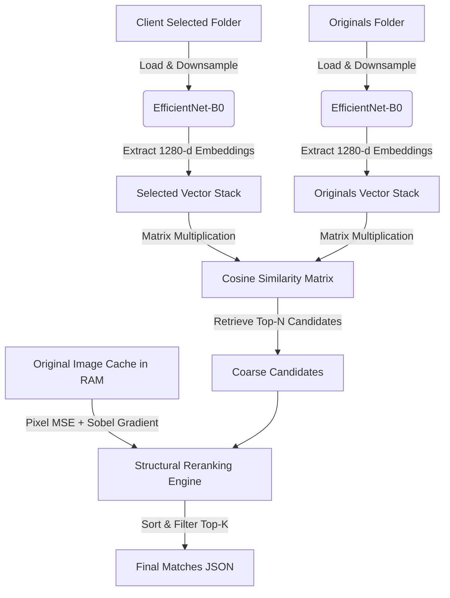

# MatchPhotos
**Disclaimer & AI Vibe Coding Notice**

This project was rapidly prototyped and generated entirely via **AI Vibe Coding** (using LLMs). It has not undergone manual code review, formal refactoring, or rigorous performance optimization. I do not guarantee absolute performance, speed, accuracy, or usability. In critical workflows, some matching results may still require manual verification. Use at your own risk!

---

## Part 1: User Guide (For Photographers)
### Workflow Best Practices vs. This Tool
- **The Ideal Workflow (Highly Recommended):**

	Whenever possible, ask your clients to select photos using unique identifiers (such as the original file names). If they send you a folder of original files, you can quickly generate a text list of their selections by opening your terminal, navigating to that folder, and running:
	```bash
	ls > selections.txt
	```
- **When to Use MatchPhotos:**

	If your client sends back heavily compressed, downscaled images with scrambled filenames (e.g., via WeChat, iCloud Shared Albums, or WhatsApp) where all original metadata (EXIF) has been stripped, you cannot use the ideal workflow. **MatchPhotos** is designed as a fallback tool to automate the mapping process and save you hours of manual searching.

### Installation
We highly recommend running this project in an **isolated environment** (either a dedicated conda environment or a local Python virtual environment `.venv`) to prevent dependency conflicts.

#### Option A: Anaconda + PDM (Recommended)
This method uses Anaconda to manage the Python version and PDM to precisely lock and install dependencies.

1. **Create and activate a dedicated Anaconda environment:**
	```bash
	conda create -n MatchPhotos python=3.11
	conda activate MatchPhotos
	```
2. **Install PDM inside your active environment:**
	```bash
	pip install pdm
	```
3. **Install the project dependencies:**
	Navigate to the project directory containing `pyproject.toml` and run:
	```bash
	pdm install
	```

#### Option B: Manual Installation (pip / conda)
If you prefer not to use PDM, you can install the packages manually.

1. **Create and activate your Anaconda environment:**
	```bash
	conda create -n MatchPhotos python=3.11
	conda activate MatchPhotos
	```
2. **Install via pip:**
	```bash
	pip install opencv-python pillow imagehash numpy tqdm torch torchvision pillow-heif
	```
	*(Alternatively, you can install compatible versions of these packages using `conda install` from the Anaconda channels).*

### How to Run
#### Step 1: Run the Matcher
Point the script to your client's selections folder and your high-res originals folder.

```bash
python main.py --selected /path/to/client_selections --originals /path/to/highres_originals
```

*Note: On the first run, the script will scan and index your original photos. It creates a cache file (`originals_emb.npz`) so subsequent runs on the same original set will start instantly.*

#### Step 2: Export Results for Capture One/Lightroom
Once matching completes, it generates a `result.json` file. Convert this into an easy-to-use text file:
```bash
python export_txt.py --json result.json --out out.txt
```

This script outputs:
1. A text file (`out.txt`) listing all the matched original filenames.
2. A **space-separated list of filenames** printed directly to your terminal. You can copy and paste this text string directly into the search/filter bar of **Capture One** or **Lightroom** to isolate the selected files instantly.

## Part 2: Technical Specifications (For Developers)
### Pipeline Architecture


### Key Performance & Algorithmic Features
#### 1. Device-Agnostic Acceleration
The hardware accelerator is dynamically selected using PyTorch's modern unified API:
```python
(
        cast(torch.device, accelerator.current_accelerator())
        if accelerator.is_available()
        else torch.device("cpu")
    )
    
```

This ensures native, optimal execution on NVIDIA GPUs (CUDA), Apple Silicon (MPS via `torch.backends.mps`), or CPU fallback configurations without code changes.

#### 2. Native JPEG Resolution Optimization (Draft Mode)
Decoding high-resolution JPEG files (e.g., 45MP+ RAW/JPG files) is highly CPU-bound. To bypass full-resolution decoding overhead, we utilize PIL’s `draft` mode:
```python
            img.draft("RGB", (draft_size, draft_size))
```

This instructs the underlying `libjpeg` decoder to downsample the image during the decoding process, yielding a **5x to 10x speedup** in overall I/O processing times.

#### 3. RAM-Cached Structural Reranking
Deep features from CNNs (like `EfficientNet-B0`) excel at semantic understanding but struggle to differentiate between consecutive frames in a burst-shot sequence (where the only difference is an eye blink or minor subject movement).
- **Coarse Stage:** The script performs a fast cosine similarity search to find the top `N` (default: 30) candidates.
- **Fine Stage:** The script caches small `uint8` representations (default: 256px) of all original images in RAM (occupying only ~600MB for 3,000 images). It then performs a local structural comparison against these cached representations using a weighted combination of:
	- **L2 Pixel Distance (MSE)**: Differentiates overall color variations and composition shifts.
	- **Sobel Gradient Difference**: Captures high-frequency edges to isolate subtle motion shifts and expression changes.

### Hyperparameters and Tuning
| Parameter       | Default | Purpose                                                                                                                                                      |
| --------------- | ------- | ------------------------------------------------------------------------------------------------------------------------------------------------------------ |
| `--candidates`  | `30`    | The size of the candidate pool passed from the CNN stage to the structural rerank stage. Increase to `50` or `80` if you have highly repetitive burst shots. |
| `--rerank-size` | `256`   | The resolution of the cached thumbnails. `256` offers a great balance between precision and RAM usage.                                                       |
| `--batch-size`  | `32`    | CNN batch size. Lower this to `16` or `8` if you encounter memory limitations on lower-end hardware.                                                         |
